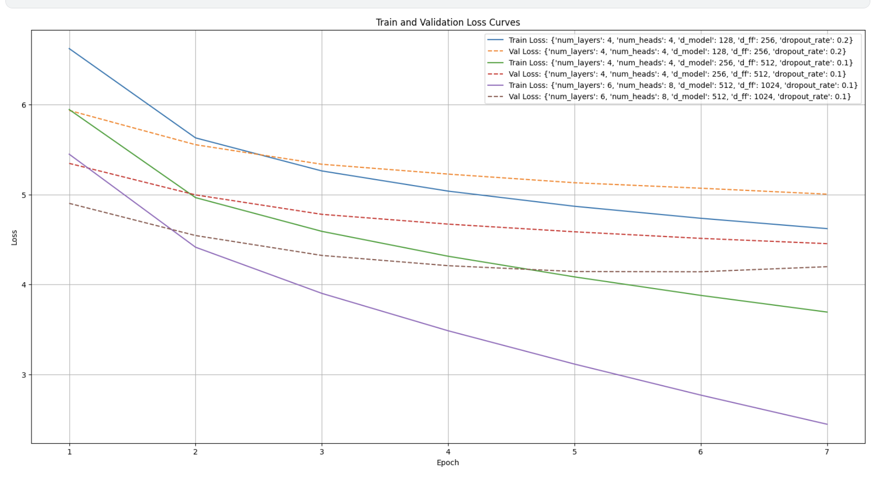

# Attention Is All You Need (Transformer)

## Task: Machine Translation

```markdown
Design and present the architecture of the transformer model from scratch 
for the task of machine translation. 

This should include all components of the original transformer architecture. 

You are not allowed to use any readily available Torch modules related to 
transformers, such as the decoder module, encoder module, etc.

You must train your transformer for the machine translation task. You are
provided with a parallel corpus of English and French sentences for training
on this task. The corpus includes train, dev, and test splits that should be
used in a similar manner.
```

## Corpus

The data can be downloaded from [here](https://iiitaphyd-my.sharepoint.com/:u:/g/personal/advaith_malladi_research_iiit_ac_in/EfJobufGgdRLt7PPNNLY9pwBZqdqzurkFJ5hznQYiF1pbQ?e=zy5XZa). The dataset is a subset of the dataset for the English-French translation task in IWSLT 2016. It contains the files for train, dev, and test splits as follows:

1. train.[en–fr]: 30,000 lines each
2. dev.[en–fr]: 887 lines each
3. test.[en–fr]: 1,305 lines each

Modules required to run the [code](./code.ipynb):

```markdown
- torch
- nltk
- rouge-score
- math
- tqdm
- numpy
- gc
```

## Hyperparameter Tuning and Analysis of the results

Note: Training is done for 7 epochs per config and a subset of train samples have been included for training with `batch_size` = 18. All dev samples were used to perform validation over the model’s performance.

Translation metrics used:

1. **BLEU**: The metric primarily measures **n-gram overlap**, where n-grams are contiguous sequences of n items from the text, and it incorporates a **brevity penalty** to discourage overly short translations. BLEU scores range from 0 to 1, with higher scores indicating greater similarity to the reference translations
2. **ROUGE**-**L**: It focuses on the longest common subsequence between the machine-generated output and reference text, measuring how well the translated text preserves the original meaning and structure. ROUGE-L emphasizes recall, assessing how much of the reference content is captured in the translation, thus providing a different perspective compared to BLEU's precision-focused approach.

*Reasoning behind the choice:*

- **BLEU** is favored for its simplicity and speed of computation, allowing for quick assessments across large datasets. However, it has limitations, such as being sensitive to exact matches and often failing to capture semantic meaning due to its reliance on string similarity.
- **ROUGE-L** complements BLEU by focusing on content retention and structure, making it valuable for understanding how well a translation conveys meaning rather than just matching words. This can be especially useful when translations vary significantly in phrasing but still maintain fidelity to the original message.

### Configs:

| Hyperparams | `num_layers` | `num_heads` | `d_model` | `hidden_dim` | `dropout` |
| --- | --- | --- | --- | --- | --- |
| Config-1 | 4 | 4 | 128 | 256 | 0.2 |
| Config-2 | 4 | 4 | 256 | 512 | 0.1 |
| Config-3 | 6 | 8 | 512 | 1024 | 0.1 |

### Training & Validation Loss:

From the loss curves, it's clear that the model consistently reduces the training loss and validation loss across all configurations as epochs increase. 



### Loss Curves Insights:

All models showed a steady decrease in loss, but I noticed that the models with smaller hidden dimensions or higher dropout rates (0.2) converged more slowly. This slower convergence suggests that regularization was preventing them from memorizing the training data too quickly, which is likely why they performed better in terms of generalization. However, the more complex models (with larger dimensions and lower dropout rates) overfit the data more quickly, as shown by the wider gap between training and validation loss.


### Hyperparameter Impact:

- **Number of Layers:** The deeper models (6 layers) outperformed the shallower ones (4 layers). This makes sense because a deeper model can capture more complex relationships between words in a sentence, which is crucial for a fairly complex task like translation.
- **Attention Heads:** Increasing the number of attention heads from 4 to 8 generally improved performance. With more heads, the model could attend to different parts of the input sentence simultaneously, which helped it better understand and translate complex structures.
- **Model Dimensions:** Larger model dimensions (512 and 1024) led to better BLEU and ROUGE-L scores, as these allowed the model to learn richer representations of the input data. However, this also increased the risk of overfitting, as I observed from the increasing validation loss.
- **Dropout Impact**: The difference in performance between the 0.1 and 0.2 dropout rates highlights the trade-off between learning capacity and regularization. While a 0.1 dropout rate allows the model to learn more complex representations and achieve higher training performance, it comes at the cost of generalization. In contrast, the 0.2 dropout models were more stable across training and validation, sacrificing some peak performance for better generalization.

### BLEU and ROUGE-L metric curves:


### ROUGE-L Score Insights:

The ROUGE-L score focuses on the longest common subsequence (LCS) between the predicted and reference sentences, which is a good indicator of fluency and alignment between translations.

1. **ROUGE-L Correlates with BLEU:**
The ROUGE-L scores showed a similar trend to the BLEU scores, where the **larger models** consistently outperformed the smaller ones. The model with **6 layers, 8 heads, and 1024 hidden dimensions** achieved the highest ROUGE-L score of approximately **0.30**. This suggests that the larger model not only produces translations that are precise but also fluently aligned with the reference translations, as reflected by the longer common subsequences.
2. **Gradual Improvement Over Time:**
ROUGE-L scores improved steadily across epochs, indicating that the models were learning to generate more aligned translations over time. Larger models, again, showed faster and more consistent improvements in ROUGE-L compared to smaller models. The ROUGE-L curves are smoother, reflecting that the models were becoming more adept at capturing the overall structure of the translations as they trained longer.


### BLEU Score Insights:

The BLEU score evaluates the precision of n-grams between the generated translations and reference translations, with an emphasis on fluency and correctness. From the charts provided, the BLEU score trends show several insights:

1. **Higher BLEU with Larger Models:**
The best BLEU score of 0.31 was achieved by the model with **6 layers, 8 heads, and 1024 hidden dimensions**. This configuration allows for deeper and more robust contextual understanding, enabling the model to generate more fluent and accurate translations. The larger number of attention heads and hidden dimensions enables the model to focus on different aspects of the sentence simultaneously, improving its ability to handle more complex sentence structures and idiomatic expressions in the translation task.
2. **BLEU Improvements Over Time:**
As training progressed across epochs, the BLEU scores improved consistently for all configurations. However, I observed that the **larger models** (more layers, larger hidden dimensions, and more heads) achieved higher scores at a **faster rate**. This suggests that larger models are able to learn richer linguistic patterns more quickly, which translates into better performance as training continues.
3. **BLEU Plateaus:**
After a certain point (around epoch 5-6), the BLEU scores seem to plateau for most configurations, indicating that the models reach their capacity in terms of how much they can learn from the data. This could suggest that further training without additional regularization or learning rate adjustments may not lead to significant improvements, and overfitting might start occurring after this point.

## Evaluation of the best model over test set:

> Model checkpoint: [https://drive.google.com/file/d/1KFxnVfVePi_rS9eLd6tVW5xknQcBmDQ9/view?usp=drive_link](https://drive.google.com/file/d/1KFxnVfVePi_rS9eLd6tVW5xknQcBmDQ9/view?usp=drive_link)
> 

**`Average Test Loss: 3.9965`**


Demonstration of some translations:


*Note: `avis` in french translates to opinion.*


### BLEU Score Analysis


### Performance Analysis:

From the above graph of **Average BLEU Score vs Sentence Length**, we can observe several important trends and insights regarding the performance of the model on the test dataset:

1. **Significant Drop for Short Sentences (1-5 words):**
    - The BLEU score starts very high (above 0.8) for sentences with a length of around 1 to 5 words, which is expected. Shorter sentences are easier for the model to handle since they require minimal contextual understanding and often have fewer variations in possible translations. The high BLEU score here suggests that the model is quite adept at generating accurate translations for such short and straightforward sentences.
2. **Drop Between 5-15 Words:**
    - There is a noticeable drop in BLEU score as sentence length increases from 5 to around 15 words. This steep decline is likely due to the model's reduced ability to capture context and dependencies in longer sentences. As the number of tokens increases, the challenge of correctly predicting n-grams grows, leading to more mismatches between the predicted and reference sentences, which lowers the BLEU score.
3. **Stabilization (15-50 Words):**
    - After the initial sharp decline, the BLEU score stabilizes between 0.2 and 0.3 for sentences ranging from around 15 to 50 words in length. This indicates that while the model is not performing as well on these longer sentences, it has learned a baseline level of accuracy that allows it to maintain a somewhat consistent performance.
    - This stabilization suggests that the model is not outright failing to generate translations for longer sentences, but it's also not capturing enough of the precise n-grams to score high on the BLEU metric. It might be that the model is predicting translations that are correct in meaning but differ in phrasing, which lowers the BLEU score but still indicates a partially correct translation.
4. **Longer Sentences (50+ Words):**
    - The BLEU score for sentences longer than 50 words continues to hover around 0.2 or lower, and there is no significant recovery. This suggests that for very long sentences, the model struggles even more to maintain accuracy, likely due to the increasing complexity of the sentence structure and word dependencies.
    - Long sentences involve complex grammar and nuanced sentence structures, and the BLEU score reflects the model's difficulty in matching the reference translations in such cases. The drop-off for sentences beyond 50 words indicates that the model either generates overly simplistic translations or fails to maintain coherence across the entire sentence.
5. **BLEU's Sensitivity to Exact Match:**
    - BLEU is a metric that relies heavily on exact n-gram matches, and this performance trend indicates that while the model is capable of capturing the broad meaning of a sentence, it struggles with getting exact matches for longer and more complex sentences. The sentences with very low BLEU scores may still be semantically correct but lack the precise word choices or n-gram patterns needed to score well in BLEU.

### General Insights:

- **Predicting First Few Words Correctly:**
I observed that if the model predicts the first few words correctly, it is more likely to predict the rest of the sentence well (almost entirely correct). This makes sense as getting the initial context right is critical in translation. The sharp decline in BLEU score after shorter sentences may reflect cases where the initial context prediction is wrong, causing subsequent predictions to deviate more from the reference. For longer sentences, once the first few words are wrong, the rest of the translation is likely to go off course, leading to lower BLEU scores.
- **Complexity with Longer Sentences:**
The model seems to struggle with longer sentences, likely because they require a better understanding of long-range dependencies and more complex sentence structures. The graph clearly shows that as sentence length increases, the model's ability to match the reference translation diminishes.

---